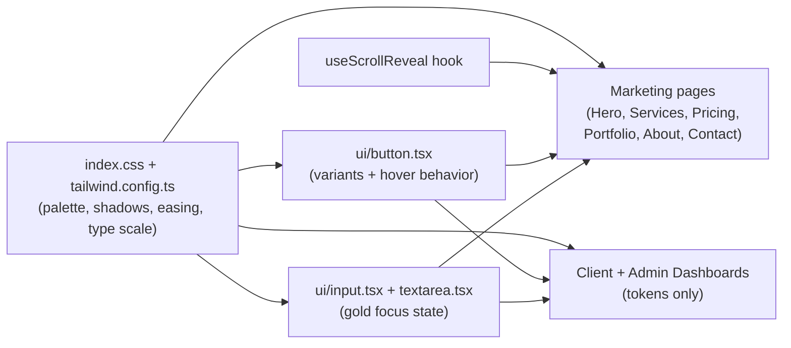

## Direction

- **Balanced refinement** of the existing visual system. Same palette, same page architectures.
- **Tokens-only** sync between marketing site and portals — every interactive element (buttons, links, cards, images, headers, inputs) gets the same upgraded behavior, but sidebars/layouts in [ClientDashboard.tsx](src/pages/ClientDashboard.tsx) and [AdminDashboard.tsx](src/pages/AdminDashboard.tsx) stay structurally untouched.
- Inspiration take-aways:
  - **From Nainoa**: image zoom + caption reveal on hover, scroll-triggered fade/slide reveals, slow elegant easing, restrained but confident type scale, subtle arrow-led nav cues.
  - **From Noelani**: traveling underline link hover, slightly bolder display headings, friendly button hover transitions.

## Files I'll touch

### 1. Design tokens — [src/index.css](src/index.css) + [tailwind.config.ts](tailwind.config.ts)

- Extend the CSS variables in [src/index.css](src/index.css) with richer hover/transition tokens:

```css
--shadow-elev-1: 0 1px 2px hsl(220 15% 20% / 0.04), 0 8px 24px -12px hsl(220 15% 20% / 0.10);
--shadow-elev-2: 0 4px 12px hsl(220 15% 20% / 0.06), 0 18px 40px -16px hsl(220 15% 20% / 0.18);
--shadow-gold-soft: 0 1px 0 hsl(143 10% 51% / 0.4) inset, 0 8px 24px -10px hsl(143 10% 51% / 0.35);
--ease-elegant: cubic-bezier(0.22, 1, 0.36, 1);
--ease-quiet:   cubic-bezier(0.4, 0, 0.2, 1);
--transition-elegant: all 0.6s var(--ease-elegant);
--transition-quiet: all 0.3s var(--ease-quiet);
```

- Add new keyframes/utilities in [src/index.css](src/index.css):
  - `reveal-up` (opacity 0 + translateY(24px) → 1, 0) with 0.8s `--ease-elegant`
  - `reveal-fade` (opacity 0 → 1) with 0.9s ease-out
  - `.hover-image` wrapper: image scales `1.0 → 1.06` over 1.2s with caption layer fading in
  - `.link-underline`: traveling underline using `bg-[length]` trick on a pseudo-bottom border (left → right reveal)
  - `.text-balance` utility for headings
- In [tailwind.config.ts](tailwind.config.ts):
  - Add tighter heading tracking (`letterSpacing`) tokens
  - Add `fontSize` scale: `display-xl`, `display-lg`, `display-md`, `eyebrow` (uppercase tracked label)
  - Add `keyframes` and `animation` entries for `reveal-up`, `reveal-fade`, `marquee-arrow`

### 2. Button system — [src/components/ui/button.tsx](src/components/ui/button.tsx)

Replace the flat hover-on-opacity behavior with layered transitions. Each variant gets:

- `transition-elegant` (slower, elegant easing)
- A tracked-uppercase option for hero/marketing buttons (`tracking-[0.2em] uppercase text-xs/sm`)
- Inner span pattern for `→` icon slide on hover (`group-hover:translate-x-1`)
- Subtle inset shadow + border on `gold` for depth
- New variant: `link-underline` for header nav use

Example shape (will fully replace the file):

```tsx
gold: "group relative overflow-hidden bg-gold text-primary-foreground border border-gold-dark/40 \
  shadow-[var(--shadow-gold-soft)] hover:shadow-[var(--shadow-elev-2)] \
  hover:bg-gold-dark transition-[var(--transition-elegant)] \
  before:absolute before:inset-0 before:translate-y-full before:bg-gold-dark \
  before:transition-transform before:duration-500 before:ease-[var(--ease-elegant)] \
  hover:before:translate-y-0",
"hero-outline": "border border-primary/80 text-primary tracking-[0.18em] uppercase text-xs \
  hover:bg-primary hover:text-primary-foreground hover:border-primary \
  transition-[var(--transition-elegant)]",
```

### 3. Header / nav — [src/components/Header.tsx](src/components/Header.tsx)

- Swap nav anchor classes for a `link-underline` utility (left-to-right traveling underline using a `::after` pseudo, animated to 0.5s `--ease-elegant`)
- Make active route show a static underline
- Add subtle backdrop blur intensification on scroll (`bg-background/60 → /85` once `window.scrollY > 8`, via a small `useEffect`)
- Convert "Client Portal" + "Start a Project" to use the new button variants so they feel intentional, not generic ghost/gold

### 4. Hero — [src/components/HeroSection.tsx](src/components/HeroSection.tsx)

- Slow in: hero logo gets `reveal-fade` 1.2s, buttons cascade in with `reveal-up` and small staggered delays
- Add a Nainoa-style scroll cue at the bottom: thin vertical line + arrow that gently slides down on a 2s loop
- Increase the gradient overlay subtly so type pops more

### 5. Image-led sections — [src/components/PortfolioSection.tsx](src/components/PortfolioSection.tsx) + [src/pages/ProjectDetail.tsx](src/pages/ProjectDetail.tsx)

- Replace `group-hover:scale-110` (700ms ease) with a Nainoa-style `1.0 → 1.06` over 1.2s `--ease-elegant`
- Add a caption reveal: title + arrow (`→`) translate up from `translate-y-2 opacity-0` to `0,1` on hover, with the eyebrow category text turning gold
- Wrap each tile in a scroll-reveal observer so cards staggered fade-up as they enter the viewport

### 6. Section eyebrows + headings — [src/components/AboutSection.tsx](src/components/AboutSection.tsx), [src/components/ServicesSection.tsx](src/components/ServicesSection.tsx), [src/components/PricingSection.tsx](src/components/PricingSection.tsx), [src/components/ContactSection.tsx](src/components/ContactSection.tsx)

- Apply new heading scale (`text-display-lg` for h2, `text-display-xl` for hero h1) and `text-balance`
- Standardize the gold eyebrow to a single `<span className="eyebrow">…</span>` utility (uppercase, `tracking-[0.3em]`, with a small horizontal line accent before the text — Nainoa-style)
- Add scroll-triggered reveals (a tiny shared `useScrollReveal` hook in `src/hooks/`) so eyebrow → heading → body cascade in
- Service/Pricing cards get refined hover: lift + soft elevation + icon container background fades from `gold/10 → gold/20`, plus icon micro-rotation/scale

### 7. Forms / inputs

- Update [src/components/ui/input.tsx](src/components/ui/input.tsx) and [src/components/ui/textarea.tsx](src/components/ui/textarea.tsx):
  - Replace static border with a focus-state border that animates from neutral to `gold` (`focus-visible:border-gold focus-visible:ring-gold/20 transition-[border,box-shadow]`)
  - Slightly taller default height (`h-11`) so they feel premium
- Auth pages ([src/pages/Auth.tsx](src/pages/Auth.tsx), [src/pages/AdminAuth.tsx](src/pages/AdminAuth.tsx)) automatically inherit; spot-check spacing only.

### 8. Footer — [src/components/Footer.tsx](src/components/Footer.tsx)

- Apply the traveling-underline link hover
- Tighten heading tracking and refine spacing rhythm

### 9. Portals — tokens-only sync

Touch only the surfaces that visually expose the design system (sidebars/layout structure stay the same):

- **Both [ClientDashboard.tsx](src/pages/ClientDashboard.tsx) and [AdminDashboard.tsx](src/pages/AdminDashboard.tsx)**:
  - Replace inline `font-display text-3xl font-semibold` headings with the new heading utility (so type scale matches marketing)
  - Sidebar nav items: adopt `--transition-quiet`, add the gold-accent left bar (a 2px `bg-gold` slide-in on hover/active using `before:` pseudo) to mirror the link-underline feel of the marketing nav
  - Module/dashboard tiles: same hover behavior as service cards (`-translate-y-0.5`, `shadow-elev-1 → shadow-elev-2`, icon bg fade)
  - Buttons: any `variant="gold"` / `"outline"` calls automatically pick up the new behaviors — no API changes
  - Empty states: add the eyebrow + soft icon treatment used on marketing
- Avatar circles, notification bells, status pills: align corner radius and color usage with marketing tokens (no structural change)

### 10. Scroll-reveal hook — new `src/hooks/useScrollReveal.ts`

Tiny, dependency-free `IntersectionObserver` hook returning a `ref` + `inView` boolean. Used by sections and portfolio tiles to trigger `reveal-up` once on entry. Keeps things performant — no library added.

## Animation cheat sheet (consistent across the site)

- Page section reveal: `reveal-up`, 800ms, `--ease-elegant`, staggered 80–120ms
- Image hover zoom: 1.0 → 1.06, 1200ms, `--ease-elegant`
- Button hover: 600ms `--ease-elegant`, layered fill or border transition
- Link underline: 500ms `--ease-elegant`
- Card lift: `-translate-y-0.5`, 300ms `--ease-quiet`
- Sidebar/nav micro-interactions: 200–300ms `--ease-quiet` (snappy, since portal usage is fast)

## Out of scope (per your selection)

- No palette change
- No restructuring of the home page (Hero stays as the only section on `/`)
- No portal sidebar/layout restructuring
- No new pages

## Mermaid: how the system flows after the refactor

